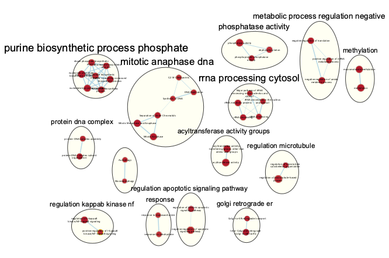

## Objective of Assignment 3
* To take the ranked data that was created in Assignment #2 
* To perform non-thresholded pathway analysis
* To summarize and visualize your results using Cytoscape and the Enrichment map pipeline.

# Introduction
## General Background
The dataset is derived from genetically engineered Foxd1Cre;Smo(flox/-) house mice and aims to investigate the mRNA content of mutant kidneys to gain a deeper understanding of the molecular mechanisms underlying the developmental defects observed in the kidney. The Hedgehog-GLI pathway, which is responsible for the development and patterning of various tissues and organs, including the kidney, interacts with the transforming growth factor beta (TGF) signaling pathway, another critical regulator of kidney development. Smo, a key component of the Hedgehog-GLI signaling pathway, plays a crucial role in human kidney development and modulates TGF&beta; signaling in the kidney, and its disruption can lead to abnormal kidney development and function (Figure 1). The ultimate goal of understanding the role of Smo in these signaling pathways is to uncover the molecular mechanisms underlying normal kidney development and diseases, which could ultimately lead to the development of new therapeutic strategies for kidney disorders. (@Rowan2018)

```{r image display1, out.width = "90%", echo = FALSE, message =FALSE, fig.cap="Figure 1. A study on the effects of Smo deletion on renal cortical stroma development. (A-D) Gli1 expression was detected by in situ hybridization in the cortical stroma and capsule (arrows). (B) Inducible Gli1Cre expression was used to show active HH signaling in the cortex. Conditional deletion of Smo using Foxd1Cre resulted in a loss of Gli1 and Smo expression at E13.5 (D, 1:0.14, n=4 Foxd1Cre;SmoloxP/+ and n=7 mutants, ***P<0.0001) as compared to controls (C). (E-H) Decreased expression of Foxd1, a stromal cell identity marker, was observed at multiple embryological time points. (I) Quantitative RT-PCR for Foxd1 showed a significant decrease in E13.5 mutant FACS-isolated stromal cells compared with control stromal cells (1:0.40, n=4 Foxd1Cre;SmoloxP/+ and n=5 mutants, *P=0.025). The study provides insights into the crucial role of HH signaling in the development of renal cortical stroma."}

```

## Previous Work
In the previous work on the dataset with accession ID GSE103923, an initial processing of the data has been done, including accessing the dataset quality, filtering the low expression gene. The dataset was downloaded in a normalized data with identified as a mixed of HUGO symbol and he Mouse Genome Informatics (MGI) symbol. Hence, a identifier mapping was performed, and no extra normalization was applied. The result of assignment one is a clean, normalized dataset stored in the root directory as "smo_exp_normalized.txt". The downloaded cleaned annotated dataset with calculated fold change and adjusted p-value is stored in the root directory as "smo_exp_annot.txt"

* Assignment 1 in htmlViewer can be found [here](https://htmlpreview.github.io/?https://github.com/bcb420-2023/Mingzheng_Liu/blob/main/Assignment1.html)

In the second stage, a differential expression analysis is performed on the dataset. The genes were ranked according to differential expression. A thresholded over-representation analysis is performed to highlight dominant themes in the top set of genes. Three sources of annotastions, Gene Ontology Biological Process (GO:BP), Reactome (REAC), and WikiPathways (WP) from g:profile are used for this analysis. The organism is specified as “mmusculus”, since the analysis is being performed on mouse genes for simulating human physiology process. The version of the annotation database is the most current version available at the time of running the analysis, as the gost function retrieves annotation data from the g:Profiler web service, which is regularly updated. For all genesets, 107 genesets were return, among which 69 genesets are up-regulated and 31 genesets are down-regulated.

* Assignment 2 in htmlViewer can be found [here](https://htmlpreview.github.io/?https://github.com/bcb420-2023/Mingzheng_Liu/blob/main/A2_MingzhengLiu.html)
 
## Preparation
Tools are needed for the GSEA analysis. Packages used:

* R (@r)
* [BiocManager](https://CRAN.R-project.org/package=BiocManager) (@morgan2021a)
* [knitr](https://yihui.org/knitr/) (@knitr)
* [ggplot2](https://ggplot2.tidyverse.org/) (@ggplot2)
* [RCurl](https://cran.r-project.org/web/packages/RCurl/index.html) (@rcurl)
* [RCy3](https://bioconductor.org/packages/release/bioc/html/RCy3.html) (@RCy3)

```{r Repare packages, message=FALSE, warning=FALSE}
if (!requireNamespace("BiocManager", quietly = TRUE))
  install.packages("BiocManager")
library(BiocManager)
if (!requireNamespace("knitr", quietly = TRUE))
  install.packages("knitr")
library(knitr)
if (!requireNamespace("ggplot2", quietly = TRUE))
  install.packages("ggplot2")
library(ggplot2)
if (!requireNamespace("RCurl", quietly = TRUE)){
  install.packages("RCurl")}
library(RCurl)
if (!requireNamespace("RCy3", quietly = TRUE)){
  BiocManager::install("RCy3")}
library(RCy3)
```

If running in a docker container, set is_docker to TRUE
```{r docker configuration}
run_docker = TRUE # TRUE if running in docker container
base_url = "localhost:1234/v1"
if(run_docker){
  base_url = "host.docker.internal:1234/v1"
  .defaultBaseUrl <- "http://host.docker.internal:1234/v1"
}
```

## Prepare dataset from Assignment 2
###Step 1: Prepare gmt file
The genesets used for GSEA analysis are collections of functionally related genes. The Bader lab geneset collection is chosen because it contains GO biological process pathways and curated pathway databases. These genesets help to identify functional themes among differentially expressed genes and to gain biological insights into the underlying mechanisms of the phenotype.
```{r gmt Prepare}
# Download mouse GO to retrieve the gmt file
# Since we are using a mouse model, we use mouse GO
# Set url of baderlab to retrieve mouse GO
data_dir <- paste0(getwd(), "/")
gmt_url = "http://download.baderlab.org/EM_Genesets/current_release/Mouse/symbol/Mouse_GO_AllPathways_no_GO_iea_March_02_2023_symbol.gmt"
# retrieve mouse GO
if (!file.exists("Mouse_GO.gmt")) {
  download.file(gmt_url, "Mouse_GO.gmt")
}
# get the gmt file path
dest_gmt_file <- paste0(data_dir, "Mouse_GO.gmt")
```

###Step 2: Prepare rnk file
The ranked list is used to provide a score for each gene based on their differential expression between the two subtypes. The scores are used to determine the position of the gene in the ranked list, which is a crucial input for GSEA analysis.
```{r rnk Prepare}
# Since the dataset is pre-normalized with logFC and adjusted p-value
# We make the rnk file from the cleaned dataset

# Load the differential expression analysis results from previous work
de_results <- read.table("smo_exp_annot.txt", header=TRUE)

# calculate rank for each gene
de_results[,"rank"] <- -log(de_results$padj, 10) * sign(de_results$log2FoldChange) 
de_results <- de_results[order(de_results$rank),]

# Combine the rank, gene IDs
rnk <- cbind(de_results$id, de_results$rank)
colnames(rnk) <- c("GeneID", "rank")

# Save the rnk file
if (!file.exists("smo_exp.rnk")) {
write.table(rnk, file="smo_exp.rnk", quote=FALSE, sep="\t", row.names=FALSE)
}
```

# Non-thresholded Gene set Enrichment Analysis (GSEA)
## Configurations for running the GSEA
```{r GSEA configuring}
# Set the path to the GSEA jar file
# The GSEA jar file is required to run GSEA automatically. 
# the gsea jar file is uploaded to the main directory.

# In order to run GSEA automatically, I need to specify the path to the gsea jar file.
# gsea jar file is uploaded to the main directory
# since in the latest release of gsea (4.0.2) they no longer release a bundled jar
gsea_jar <- paste0(data_dir,"GSEA_4.3.2/gsea-cli.sh")

# set the flag to run gsea later
run_gsea = TRUE # set back from TRUE to FALSE once I have run gsea

# set the working directory
working_dir <- getwd()

# set the gsea blank for the notebook to discover the gsea directory for itself
gsea_directory = ""
# set analysis name
analysis_name <- "Smo_KO_vs_WT"

# The ranked file from assignment 2 is uploaded in the current directory named "smo_exp.rnk"
rnk_file <- "smo_exp.rnk"
expression_file <- "smo_RNASeq_expression.gct"
classes_file <- "smo_RNASeq_classes.cls"
```

## Run GSEA
[GSEA](http://software.broadinstitute.org/gsea/index.jsp) is a Java-based program that has a range of configurable settings and can operate independently. It can be launched via its built-in user interface for a smooth workflow, or alternatively, run through a set of options via the command line to make it a seamless pipeline. The provided options are adjustable, and there are numerous additional options that can be specified to suit specific requirements. The following options have been specified:

 * gmx - path to the gmt file
 * rnk - path to the rnk file
 * collapse - false indicates that the rnk file fo not need to be collapsed 
 * nperm - number of permutations be 1000
 * scoring_scheme - weighted
 * rpt_label - name of the directory with output
 * set_max - maximum size for individual gene sets be 200, use a more stringent setting. 
 * set_min - minimum size for individual gene sets be 15
 * zip_report - false to zip output directory
 * out - directory where to place the result directory

```{r run GSEA, message=FALSE, warning=FALSE}
# since we using gsea 4.3.2
# we run the gsea from r here
if(run_gsea){
  command <- paste(
    "",gsea_jar,  
    "GSEAPreRanked -gmx", dest_gmt_file, 
    "-rnk" ,file.path(working_dir,rnk_file), 
    "-collapse false -nperm 1000 -scoring_scheme weighted -rpt_label ",analysis_name,
    "  -plot_top_x 20 -rnd_seed 12345  -set_max 200 -set_min 15 -zip_report false -out" ,working_dir, 
    " > gsea_output.txt",sep=" ")
  system(command)
}
```

## Get the name of the GSEA output directory
To create an enrichment map, locate all GSEA result directories within the current directory, and if there are multiple GSEA result folders, each one will be used for creating an enrichment map.
```{r GSEA output name}
# find the gsea_directory
if(gsea_directory == ""){
  # find the directories of gsea result
  gsea_directories <- list.files(path = working_dir, pattern = "\\.GseaPreranked")
  # get the details on the files
  details = file.info(file.path(getwd(),gsea_directories))
  # order according to newest to oldest
  details = details[with(details, order(as.POSIXct(mtime),decreasing = TRUE)), ]
  # use the newest file
  gsea_output_dir <- row.names(details)[1]
} 
```

## Non-Threshold GSEA Disscussion
1. What method did you use? What genesets did you use? Make sure to specify versions and cite your methods.

* GSEA softerware and Java is used for this GSEA anlysis step. The GSEA is in version 4.3.2 (@Subramanian2005), and Java is in version 20 (@Java). The genesets I used is the Mouse_GO_AllPathways_no_GO_iea_March_02_2023_symbol.gmt file downloaded from Baderlab, which contains gene sets of Mouse pathways and processes that are annotated with Gene Ontology  terms. It is a collection of gene sets derived from a variety of sources, including pathway databases, literature, and expert curation (@baderlab).

2. Summarize your enrichment results.

* The GSEA analysis was performed on a mouse dataset with 10,918 genes. There were no significant gene sets enriched in the up-regulated gene sets at FDR < 25%. Out of 6,808 gene sets used in the analysis, 1,561 gene sets were up-regulated, 29 gene sets were significant at FDR < 25%. 27 gene sets are significantly enriched at nominal pvalue < 1%, and 90 gene sets are significantly enriched at nominal pvalue < 5%. Out of 6,808 gene sets used in the analysis, 5,247 gene sets were down-regulated, 0 gene sets were significant at FDR < 25%. 69 gene sets are significantly enriched at nominal pvalue < 1%, and 27 gene sets are significantly enriched at nominal pvalue < 5%. The analysis also used gene set size filters with a minimum of 15 and maximum of 200, which resulted in filtering out 21,684 gene sets out of 28,492 gene sets.

3. How do these results compare to the results from the thresholded analysis in Assignment #2. Compare qualitatively. Is this a straight forward comparison? Why or why not?

* The result from Assignment #2 shows that using a threshold of p < 0.05 on a total of 10918 gene sets, all gene sets of 107 genesets were return; for the up-regulated genes sets, 69 genesets were returned; for the down-regulated genes sets, 31 genesets were returned. which is similar to the result of GSEA quantitatively. However, the top gene set return is different. No immune system function related gene set is return in this result. 
* This kind of comparsion is not straight forward. The two type of analysis in this assignment and assignment 2 are two different methods used to analyze gene expression data and identify pathways or gene sets that are differentially expressed in different conditions or phenotypes under different assumptions. The choice of the analysis depends on the specific research question. Moreover, the gene set databases used is different in this two analysis. g:profile is used in A2, and the GO from bader lab is used in this assignment. Gene set enrichment analyses typically involve testing thousands of gene sets for enrichment. To control for false positives, multiple testing corrections are often applied. Different tools may use different correction methods or have different thresholds for significance, which can affect the results.

# Visualize Gene set Enrichment Analysis in Cytoscape
## Launch Cytoscape
```{r Cytoscape launching}
# use functions from RCy3 package
# use with cytoscape app open otherwise get error
# check accept connection when open cytoscape
cytoscapePing(base.url = base_url) 
cytoscapeVersionInfo(base.url = base_url) # cytoscape info
```

## Create an Enrichment map
```{r EM set-up}
# Set up all parameters in the em command
# path to the baderlab gmt dataset used for GSEA
gmt_gsea_file <-  dest_gmt_file
# defined threshold for GSEA enrichments (need to be strings for cyrest call)
pvalue_gsea_threshold <- "0.5"
qvalue_gsea_threshold <- "0.5"
similarity_threshold <- "0.375"
similarity_metric = "COMBINED" 
cur_model_name <- analysis_name
# path to GSEA result
gsea_results_path <- file.path(gsea_output_dir,"edb")
gsea_results_filename <- file.path(gsea_results_path,"results.edb")
# path to the rank file
gsea_ranks_file <- file.path(gsea_results_path,list.files(gsea_results_path,pattern=".rnk"))

# This function to upload files is adapted from the protocol found at:
# https://github.com/BaderLab/Cytoscape_workflows/blob/master/EnrichmentMapPipeline/Protocol2_createEM.Rmd
# if using docker we need to replace all the the paths to the host path
if(run_docker) {
  upload_em_file <- function(localPath) {
    bname <- basename(localPath)
    r <- POST(
      url = paste('http://host.docker.internal:1234/enrichmentmap/textfileupload?fileName=', bname, sep=""),
      config = list(),
      body = list(file = upload_file(localPath)),
      encode = "multipart",
      handle = NULL
    )
    content(r,"parsed")$path
  }
  
  # "upload" the files to the host machine and replace each path with the host machine path
  expression_file_fullpath <- paste0(data_dir, expression_file)
  expression_file_fullpath <- upload_em_file(expression_file_fullpath)
  gmt_gsea_file <- upload_em_file(gmt_gsea_file)
  gsea_ranks_file <- upload_em_file(gsea_ranks_file)
  gsea_results_filename <- upload_em_file(gsea_results_filename)
}
  
```

```{r EM Creation}
#create EM
current_network_name <- paste(cur_model_name,pvalue_gsea_threshold,qvalue_gsea_threshold,sep="_")
# EM command
em_command = paste('enrichmentmap build analysisType="gsea" gmtFile=', gmt_gsea_file,
                   'pvalue=',pvalue_gsea_threshold, 'qvalue=',qvalue_gsea_threshold,
                   'similaritycutoff=',similarity_threshold,
                   'coefficients=',similarity_metric,'ranksDataset1=', 
                   gsea_ranks_file,'enrichmentsDataset1=',gsea_results_filename, 
                   'filterByExpressions=false')
# get the result of suid or "Failed" status
response <- commandsGET(em_command, base.url = base_url)
current_network_suid <- 0
# check response 
if(grepl(pattern="Failed", response)){
  paste(response)
} else {
  current_network_suid <- response
}
```

```{r network naming}
#check to see if the network name is unique
current_names <- getNetworkList(base.url = base_url)
if(current_network_name %in% current_names){
  #if the name already exists in the network names then put the SUID in front
  # of the name (this does not work if you put the suid at the end of the name)
  current_network_name <- paste(current_network_suid,current_network_name, sep="_")
}
response <- renameNetwork(title=current_network_name, 
                       network = as.numeric(current_network_suid),base.url = base_url)
```

Get a screenshot of the initial network.
```{r EM screenshot}
# the output image only works on localhost
# you can only output the file if it isn't on docker
# on docker is put it into the user's home directory with docker has not access to
if(!run_docker){
  fitContent()
  output_network_file <- file.path(getwd(), "initial_screenshot_network.png")
  if(file.exists(output_network_file)){
    # cytoscape hangs waiting for user response if file already exists.
    # Remove it first
    response <- file.remove(output_network_file)
  } 
  # put the new screenshot
  response <- exportImage(output_network_file, type = "png", base.url = base_url)
} 

```

* There are 73 nodes and 53 edges in the initial network. The threshold I use was p-value = 0.05 and q-value = 0.05, which results in only 7 nodes and 1 edge. I end up with using p-value = 0.5 and q-value = 0.5. I set the similarity threshold to be 0.0375 since this value is commondly used in GSEA analysis. The initial screenshot is in the following:

```{r image display2, out.width = "90%", echo = FALSE, message =FALSE, fig.cap="Figure 2. An intial enrichment Map of differentially expressed genes in E14.5 Foxd1Cre;Smo(flox/-) house mice kidney cells. The gene sets were derived from the Molecular Signatures Database (MSigDB), and the analysis was performed using GSEA software. Each node represents a gene set. The color indicates the enrichment score, where red represents enrichment and blue represents depletion. No depletion genesets is hown in this resulted map. The size of each circle represents the number of genes in the set."}

```

## Annotate your network
Annotate the creenshot by the "AutoAnnoatate" application in cytoscape.
```{r image display3, out.width = "90%", echo = FALSE, message =FALSE, fig.cap="Figure 3. Enrichment Map of differentially expressed genes in E14.5 Foxd1Cre;Smo(flox/-) house mice kidney cells. The gene sets is annotated by the AutoAnnotate in cytoscape."}

```

What parameters did you use to annotate the network. If you are using the default parameters make sure to list them as well.
* The network is annotated by the AutoAnnotate application. AutoAnnotate uses three different databases for annotation: Gene Ontology (GO), KEGG Pathways, and Reactome Pathways. It maps the genes in the input set to these databases based on their known functions, interactions, and pathways. Then, it assigns annotations to the input set based on the enriched terms. The p-value cutoff of 0.5 and minimum gene set size of 15 is used by default.

## Make a publication ready figure - include this figure with proper legends in your notebook.
```{r image display4, out.width = "90%", echo = FALSE, message =FALSE, fig.cap="Figure 4. Enrichment Map of differentially expressed genes in E14.5 Foxd1Cre;Smo(flox/-) house mice kidney cells. The gene sets were derived from the Molecular Signatures Database (MSigDB), and the analysis was performed using GSEA software. Each node represents a gene set. The color indicates the enrichment score, where red represents enrichment and blue represents depletion. Gene sets with similar functions are grouped together, and the size of each circle represents the number of genes in the set. The map shows the significant enrichment of gene sets related to kidney development. The major themes in this graph include the mitotic anaphase, metabolic process, intracellular transportation."}

```

Collapse your network to a theme network. What are the major themes present in this analysis? Do they fit with the model? Are there any novel pathways or themes?
*The major themes in this graph include the mitotic anaphase, metabolic process, intracellular transportation, which fit with the model that is used for investigating the kidney development. Most of the pathway are not novel pathways, only one cluster is unname in Figure 4.

# Interpretation and detailed view of results
1. Do the enrichment results support conclusions or mechanism discussed in the original paper? How do these results differ from the results you got from Assignment #2 thresholded methods

* The enrichment result supports the original article since most of the gene sets are involve in the development process, which makes sense since the experiment is about investigating the kidney development in fetus. The only condition is the deletion of the Smo protein in the mutant mouse. The Smo protein is the membrane receptor for the HH signal for the healthy kidney development, which makes sense that the number of final gene set in the enrichment map is limited since it is a simple pathway, only the critical gene sets that involved in the development will be present.
* The gene sets in the final enrichment map include themes of Mitotic Anaphase, Mitotic Metaphase and Anaphase, Intra-Golgi and retrograde Golgi-to-ER traffic, acyltransferase activity. These gene sets involve mitosis activities, the intracellular transportation by golgi apparatus and endoplasmic reticulus, acyltranferase activity, and oxidative phosphorylation (ATP energy generation). Other gene sets involves the targets by the MYC transcription factor and the E2F family of transcription factor. All these gene sets play an important role in the fetus development including the nephron genesis, which support the conclusions in the original paper that HH signaling in the cortical stroma is required for the expression of the key stromal gene Foxd1. Smo-deficient mice exhibited renal histological abnormalities, mis-patterning of the renal cortex, and severe patterning defects in the nephrogenic zone, resulting in a decreased number of nephrons. 
* The result is similar to the result I have in A2. Both the gene set returned result shows a overlapping of the functionality about the development. Interestingly, the result of A2 include the geneset that functions in the immune system, where as this result do not involve gene sets about the immune system.

2. Can you find evidence, i.e. publications, to support some of the results that you see. How does this evidence support your result?

* A study provides insight into the role of Myc and E2f pathways in controlling cell proliferation in normal and Rb-deficient cells in a murine intestinal model (@Liu2015). The study found that Myc and E2f1-3 synergistically control an S-G2 transcriptional program required for normal cell divisions and maintaining crypt-villus integrity in normal cells. This study highlights the complex and dynamic interplay between different proliferative pathways in controlling cell proliferation and maintaining organ architecture. This study also comfirms with my result that Myc and E2f plays a crutial role in the organ development.
* Another study provides evidence for the involvement of the E2F transcription factor family in kidney cancer development and progression (@Liang2017). The study shows that E2F1, E2F2, and E2F3 expression was increased in KIRC (kidney renal clear cell carcinoma) tissues compared to matched normal tissues, and that high expression of these genes was associated with worse overall and disease-free survival in KIRC patients. The study also suggests that E2F1 and E2F3 could serve as independent prognostic factors for overall survival in KIRC patients. This supports the notion that E2Fs are involved not only in proliferation and tumorigenesis, but also in apoptosis and differentiation, which comfirms with my result of the role of E2Fs in kidney development.

3. Choose a specific pathway or theme to investigate in more detail. Why did you choose this pathway or theme? Show the pathway or theme as a gene network or as a pathway diagram. Annotate the network or pathway with your original log fold expression values and p-values to show how it is effected in your model. (Hint: if the theme or pathway is not from database that has detailed mechanistic information like Reactome you can use apps like GeneMANIA or String to build the the interaction network.)

* I would like to investigate the theme of mitotic anaphase dna in more detail. This theme is represented by the gene sets，which involve the anaphase of cell division since these genes are involved in mitotic anaphase and DNA replication and repair. I used the STRING PROTEIN QUERY in cytoscape to build a protein interaction map. The only protein I found is UBC with rank = 0.07, which I have marked in the graph.
```{r image display5, out.width = "90%", echo = FALSE, message =FALSE, fig.cap="Figure 5. Protein interaction map of theme of mitotic anaphase dna in E14.5 Foxd1Cre;Smo(flox/-) house mice kidney cells. The analysis was performed using STRING application in cytoscape. Each node represents a protein, each edge represents a protein-protein interaction. Protein with interaction with UBC in first level or higher are grouped seperately. This map shows the significant interaction of UBC during the kidney development with respect to then theme of mitotic anaphase."}

```


# References